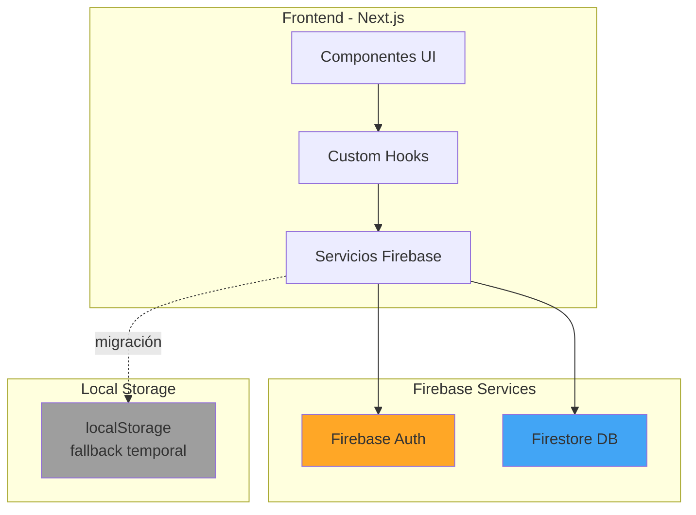
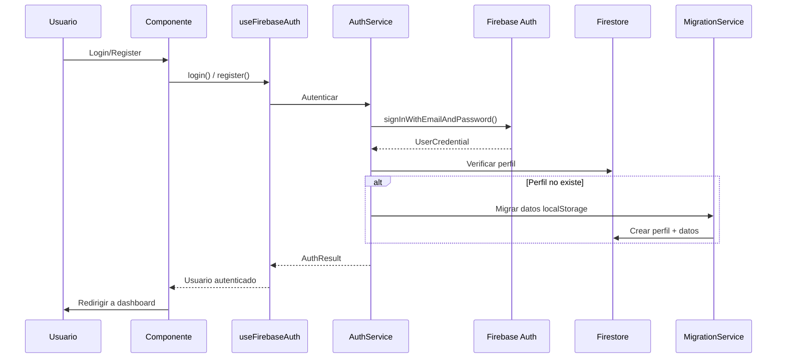
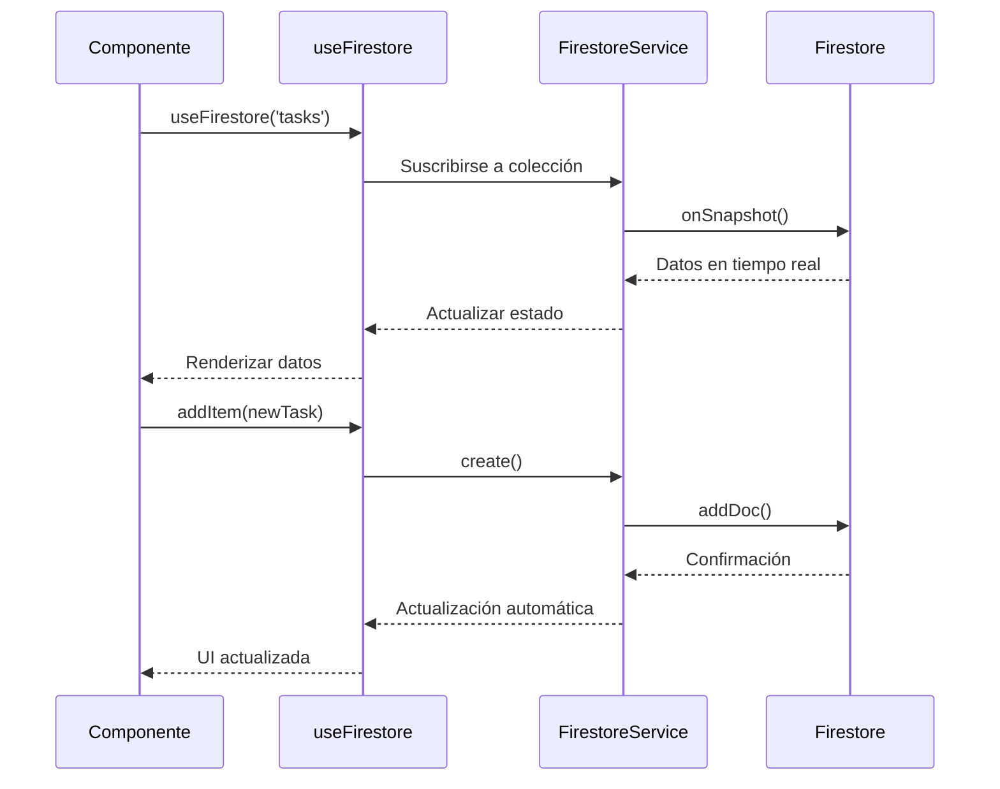
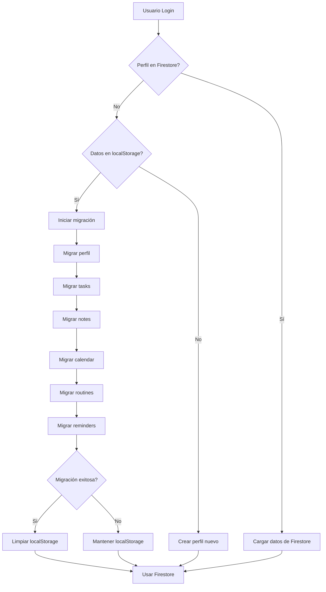

# Firebase Migration - Documento de Diseño Técnico

## Overview

Este documento describe el diseño técnico para migrar la aplicación Planiverse de localStorage a Firebase, implementando autenticación con Firebase Authentication y persistencia de datos con Firestore. La migración mantiene la funcionalidad existente mientras añade capacidades de sincronización en la nube y autenticación robusta.

### Objetivos

- Migrar autenticación de localStorage a Firebase Authentication
- Migrar persistencia de datos de localStorage a Firestore
- Implementar autenticación con email/password y Google OAuth
- Proporcionar migración automática de datos existentes en localStorage
- Mantener compatibilidad con la estructura de datos actual
- Implementar hooks personalizados para simplificar el uso de Firebase

### Alcance

**Incluye:**
- Servicios de Firebase (auth, firestore, migration)
- Hooks personalizados para autenticación y CRUD
- Actualización de componentes del wizard y dashboard
- Migración automática de datos de localStorage a Firestore
- Reglas de seguridad de Firestore

**No incluye:**
- Migración de archivos o imágenes (Storage)
- Notificaciones push
- Funcionalidad offline avanzada (se mantiene localStorage como fallback temporal)
- Analytics o monitoreo

## Architecture

### Diagrama de Arquitectura



### Flujo de Autenticación



### Flujo de Datos CRUD



## Components and Interfaces

### Servicios Firebase

#### 1. AuthService (`lib/firebase/auth.service.ts`)

Servicio para gestionar autenticación con Firebase.

```typescript
interface AuthService {
  // Registro con email/password
  register(email: string, password: string): Promise<AuthResult>;
  
  // Login con email/password
  login(email: string, password: string): Promise<AuthResult>;
  
  // Login con Google OAuth
  loginWithGoogle(): Promise<AuthResult>;
  
  // Logout
  logout(): Promise<void>;
  
  // Obtener usuario actual
  getCurrentUser(): User | null;
  
  // Observar cambios de autenticación
  onAuthStateChanged(callback: (user: User | null) => void): Unsubscribe;
}

interface AuthResult {
  success: boolean;
  user?: User;
  error?: AuthError;
}

interface AuthError {
  code: string;
  message: string;
}
```

**Responsabilidades:**
- Gestionar registro y login con Firebase Authentication
- Implementar OAuth con Google
- Manejar estado de autenticación
- Proporcionar información del usuario actual
- Gestionar errores de autenticación

#### 2. FirestoreService (`lib/firebase/firestore.service.ts`)

Servicio genérico para operaciones CRUD en Firestore.

```typescript
interface FirestoreService {
  // Crear documento
  create<T>(
    collection: string,
    data: T,
    userId: string
  ): Promise<string>;
  
  // Leer documento por ID
  read<T>(
    collection: string,
    docId: string,
    userId: string
  ): Promise<T | null>;
  
  // Leer todos los documentos de una colección
  readAll<T>(
    collection: string,
    userId: string
  ): Promise<T[]>;
  
  // Actualizar documento
  update<T>(
    collection: string,
    docId: string,
    data: Partial<T>,
    userId: string
  ): Promise<void>;
  
  // Eliminar documento
  delete(
    collection: string,
    docId: string,
    userId: string
  ): Promise<void>;
  
  // Suscribirse a cambios en tiempo real
  subscribe<T>(
    collection: string,
    userId: string,
    callback: (data: T[]) => void
  ): Unsubscribe;
}
```

**Responsabilidades:**
- Operaciones CRUD genéricas para todas las colecciones
- Gestionar rutas de colecciones por usuario
- Proporcionar suscripciones en tiempo real
- Manejar errores de Firestore

#### 3. MigrationService (`lib/firebase/migration.service.ts`)

Servicio para migrar datos de localStorage a Firestore.

```typescript
interface MigrationService {
  // Detectar si hay datos en localStorage
  hasLocalStorageData(userId: string): boolean;
  
  // Migrar todos los datos de un usuario
  migrateUserData(userId: string): Promise<MigrationResult>;
  
  // Migrar colección específica
  migrateCollection(
    collection: string,
    userId: string,
    data: any[]
  ): Promise<void>;
  
  // Limpiar localStorage después de migración exitosa
  clearLocalStorage(userId: string): void;
}

interface MigrationResult {
  success: boolean;
  migratedCollections: string[];
  errors?: MigrationError[];
}

interface MigrationError {
  collection: string;
  message: string;
}
```

**Responsabilidades:**
- Detectar datos existentes en localStorage
- Migrar datos a Firestore preservando estructura
- Validar migración exitosa
- Limpiar localStorage después de migración

### Hooks Personalizados

#### 1. useFirebaseAuth (`hooks/firebase/useFirebaseAuth.ts`)

Hook para gestionar autenticación.

```typescript
interface UseFirebaseAuth {
  user: User | null;
  loading: boolean;
  error: AuthError | null;
  
  register: (email: string, password: string) => Promise<void>;
  login: (email: string, password: string) => Promise<void>;
  loginWithGoogle: () => Promise<void>;
  logout: () => Promise<void>;
}

function useFirebaseAuth(): UseFirebaseAuth;
```

**Características:**
- Estado de autenticación reactivo
- Métodos simplificados para auth
- Manejo automático de loading y errores
- Sincronización con Firebase Auth

#### 2. useFirestore (`hooks/firebase/useFirestore.ts`)

Hook genérico para operaciones CRUD.

```typescript
interface UseFirestore<T> {
  data: T[];
  loading: boolean;
  error: Error | null;
  
  addItem: (item: Omit<T, 'id'>) => Promise<void>;
  updateItem: (id: string, updates: Partial<T>) => Promise<void>;
  deleteItem: (id: string) => Promise<void>;
  refreshData: () => Promise<void>;
}

function useFirestore<T>(collection: string): UseFirestore<T>;
```

**Características:**
- Suscripción automática a cambios en tiempo real
- Operaciones CRUD simplificadas
- Estado reactivo con loading y errores
- Limpieza automática de suscripciones

## Data Models

### Estructura de Firestore

```
firestore/
├── users/
│   └── {userId}/
│       ├── profile (documento)
│       ├── tasks/ (subcolección)
│       │   └── {taskId}
│       ├── notes/ (subcolección)
│       │   └── {noteId}
│       ├── calendar/ (subcolección)
│       │   └── {eventId}
│       ├── routines/ (subcolección)
│       │   └── {routineId}
│       └── reminders/ (subcolección)
│           └── {reminderId}
```

### Esquemas de Documentos

#### UserProfile

```typescript
interface UserProfile {
  userId: string;
  email: string;
  fullName: string;
  nickname: string;
  age: number;
  role: 'student' | 'teacher' | 'other';
  selectedModules: string[];
  theme: Theme;
  authMethod: 'email' | 'google';
  createdAt: Timestamp;
  updatedAt: Timestamp;
}
```

#### Task

```typescript
interface Task {
  id: string;
  title: string;
  description?: string;
  completed: boolean;
  priority: 'low' | 'medium' | 'high';
  dueDate?: Timestamp;
  createdAt: Timestamp;
  updatedAt: Timestamp;
}
```

#### Note

```typescript
interface Note {
  id: string;
  title: string;
  content: string;
  tags: string[];
  createdAt: Timestamp;
  updatedAt: Timestamp;
}
```

#### CalendarEvent

```typescript
interface CalendarEvent {
  id: string;
  title: string;
  description?: string;
  startDate: Timestamp;
  endDate: Timestamp;
  allDay: boolean;
  color?: string;
  createdAt: Timestamp;
  updatedAt: Timestamp;
}
```

#### Routine

```typescript
interface Routine {
  id: string;
  title: string;
  description?: string;
  frequency: 'daily' | 'weekly' | 'monthly';
  days?: number[]; // Para weekly: 0-6 (domingo-sábado)
  time?: string; // HH:mm format
  active: boolean;
  createdAt: Timestamp;
  updatedAt: Timestamp;
}
```

#### Reminder

```typescript
interface Reminder {
  id: string;
  title: string;
  description?: string;
  reminderDate: Timestamp;
  completed: boolean;
  createdAt: Timestamp;
  updatedAt: Timestamp;
}
```

### Mapeo de localStorage a Firestore

| localStorage Key | Firestore Path |
|-----------------|----------------|
| `planiverse_users` | `users/{userId}/profile` |
| `planiverse_profiles` | `users/{userId}/profile` |
| `planiverse_tasks` | `users/{userId}/tasks/{taskId}` |
| `planiverse_notes` | `users/{userId}/notes/{noteId}` |
| `planiverse_calendar` | `users/{userId}/calendar/{eventId}` |
| `planiverse_routines` | `users/{userId}/routines/{routineId}` |
| `planiverse_reminders` | `users/{userId}/reminders/{reminderId}` |

## Migration Strategy

### Detección de Datos

El sistema detecta automáticamente si hay datos en localStorage al iniciar sesión:

1. Usuario se autentica con Firebase
2. Sistema verifica si existe perfil en Firestore
3. Si no existe perfil, busca datos en localStorage
4. Si encuentra datos, inicia migración automática

### Proceso de Migración



### Estrategia de Fallback

Durante el período de transición:

1. **Prioridad a Firestore**: Si el usuario está autenticado, usar Firestore
2. **Fallback a localStorage**: Si hay error de red, usar localStorage temporalmente
3. **Sincronización**: Cuando se recupere la conexión, sincronizar cambios
4. **Indicador visual**: Mostrar al usuario si está en modo offline

### Manejo de Conflictos

Si hay datos tanto en localStorage como en Firestore:

1. **Prioridad a Firestore**: Los datos en Firestore son la fuente de verdad
2. **Backup de localStorage**: Guardar datos de localStorage en una colección especial
3. **Notificar al usuario**: Informar que se encontraron datos duplicados
4. **Opción de recuperación**: Permitir al usuario revisar datos de localStorage

## Component Updates

### Wizard Components

#### AuthStep

**Cambios necesarios:**
- Reemplazar `AuthService.login()` por `useFirebaseAuth().login()`
- Reemplazar `AuthService.handleOAuthCallback()` por `useFirebaseAuth().loginWithGoogle()`
- Eliminar manejo manual de localStorage
- Añadir manejo de errores de Firebase

```typescript
// Antes
const result = await AuthService.login(email, password);

// Después
const { login, error } = useFirebaseAuth();
await login(email, password);
```

#### RegisterStep

**Cambios necesarios:**
- Reemplazar `AuthService.register()` por `useFirebaseAuth().register()`
- Eliminar manejo manual de localStorage
- Añadir validación de Firebase (email ya existe, etc.)

```typescript
// Antes
const result = await AuthService.register(email, password);

// Después
const { register, error } = useFirebaseAuth();
await register(email, password);
```

#### UserDataStep

**Cambios necesarios:**
- Actualizar perfil en Firestore en lugar de localStorage
- Usar `FirestoreService.update()` para guardar datos

```typescript
// Antes
LocalStorageManager.saveProfile(profile);

// Después
await FirestoreService.update('profile', userId, profileData, userId);
```

### Dashboard Components

#### Tasks Module

**Cambios necesarios:**
- Usar `useFirestore<Task>('tasks')` para obtener y gestionar tareas
- Eliminar llamadas a localStorage
- Aprovechar actualizaciones en tiempo real

```typescript
// Antes
const [tasks, setTasks] = useState<Task[]>([]);
useEffect(() => {
  const data = localStorage.getItem('planiverse_tasks');
  setTasks(JSON.parse(data || '[]'));
}, []);

// Después
const { data: tasks, addItem, updateItem, deleteItem } = useFirestore<Task>('tasks');
```

#### Notes Module

**Cambios similares a Tasks:**
- Usar `useFirestore<Note>('notes')`
- Sincronización automática en tiempo real

#### Calendar Module

**Cambios similares:**
- Usar `useFirestore<CalendarEvent>('calendar')`
- Convertir fechas a Timestamp de Firebase

#### Routines Module

**Cambios similares:**
- Usar `useFirestore<Routine>('routines')`

#### Reminders Module

**Cambios similares:**
- Usar `useFirestore<Reminder>('reminders')`

### Profile Page

**Cambios necesarios:**
- Cargar perfil desde Firestore
- Actualizar perfil en Firestore
- Mostrar información de autenticación (método, email)

```typescript
const { user } = useFirebaseAuth();
const profile = await FirestoreService.read('profile', user.uid, user.uid);
```

## Firestore Security Rules

```javascript
rules_version = '2';
service cloud.firestore {
  match /databases/{database}/documents {
    
    // Helper function: usuario autenticado
    function isAuthenticated() {
      return request.auth != null;
    }
    
    // Helper function: usuario es dueño del recurso
    function isOwner(userId) {
      return isAuthenticated() && request.auth.uid == userId;
    }
    
    // Reglas para usuarios
    match /users/{userId} {
      // Permitir lectura solo al dueño
      allow read: if isOwner(userId);
      
      // Permitir escritura solo al dueño
      allow write: if isOwner(userId);
      
      // Reglas para perfil
      match /profile {
        allow read: if isOwner(userId);
        allow write: if isOwner(userId);
      }
      
      // Reglas para subcolecciones
      match /{collection}/{document=**} {
        allow read: if isOwner(userId);
        allow create: if isOwner(userId) 
          && request.resource.data.createdAt is timestamp
          && request.resource.data.updatedAt is timestamp;
        allow update: if isOwner(userId)
          && request.resource.data.updatedAt is timestamp;
        allow delete: if isOwner(userId);
      }
    }
  }
}
```

### Validaciones en las Reglas

**Validaciones comunes:**
- Usuario autenticado
- Usuario es dueño del recurso
- Timestamps requeridos (createdAt, updatedAt)
- Tipos de datos correctos

**Validaciones específicas por colección:**
- Tasks: `completed` debe ser boolean
- Notes: `tags` debe ser array
- Calendar: `startDate` < `endDate`
- Routines: `frequency` debe ser enum válido
- Reminders: `reminderDate` debe ser timestamp futuro

## Correctness Properties

*A property is a characteristic or behavior that should hold true across all valid executions of a system—essentially, a formal statement about what the system should do. Properties serve as the bridge between human-readable specifications and machine-verifiable correctness guarantees.*

### Property Reflection

After analyzing the acceptance criteria, I identified the following properties. During reflection, I found these potential redundancies:

- Properties 2.1 and 5.1 both test user data isolation - combined into Property 6
- Properties 2.3 and 5.2 both test timestamp requirements - combined into Property 7
- Properties 6.1 and 6.2 test offline/online behavior - kept separate as they test different aspects

### Authentication Properties

#### Property 1: User Registration Creates Account

*For any* valid email and password combination, registering with Firebase Authentication should successfully create a new user account with a unique user ID.

**Validates: Requirements 1.1**

#### Property 2: Valid Login Returns User Data

*For any* existing user with valid credentials, logging in should authenticate the user and return their user data including uid and email.

**Validates: Requirements 1.2**

#### Property 3: Google OAuth Authentication

*For any* successful Google OAuth flow, Firebase Authentication should create or retrieve a user account and return authentication credentials.

**Validates: Requirements 1.3**

#### Property 4: Logout Clears Session

*For any* authenticated user, logging out should clear the Firebase session and set the current user to null.

**Validates: Requirements 1.4**

### Firestore CRUD Properties

#### Property 5: Document Creation in User Subcollection

*For any* document and collection type, creating a document should store it in the path `users/{userId}/{collection}/{docId}` where userId matches the authenticated user.

**Validates: Requirements 2.1**

#### Property 6: User Data Isolation

*For any* authenticated user and collection, reading documents should return only documents where the path contains that user's userId, never documents from other users.

**Validates: Requirements 2.2, 5.1**

#### Property 7: Update Timestamp Invariant

*For any* document update operation, the resulting document should have an `updatedAt` timestamp that is greater than or equal to the timestamp before the update.

**Validates: Requirements 2.3, 5.2**

#### Property 8: Document Deletion Removes Data

*For any* document in Firestore, after calling delete on that document, subsequent read operations should return null or empty for that document ID.

**Validates: Requirements 2.4**

#### Property 9: Real-time Subscription Updates

*For any* collection subscription, when a document is added, updated, or deleted in that collection, the subscription callback should be invoked with the updated data within a reasonable time window.

**Validates: Requirements 2.5**

### Migration Properties

#### Property 10: localStorage Detection

*For any* user logging in for the first time after migration implementation, if localStorage contains data with keys matching `planiverse_*`, the migration service should detect this data.

**Validates: Requirements 3.1**

#### Property 11: Migration Data Preservation (Round-trip)

*For any* data structure in localStorage, after migrating to Firestore and reading it back, the data should be equivalent to the original (accounting for type conversions like Date to Timestamp).

**Validates: Requirements 3.2**

#### Property 12: Successful Migration Cleanup

*For any* successful migration operation, all `planiverse_*` keys should be removed from localStorage after migration completes.

**Validates: Requirements 3.3**

#### Property 13: Failed Migration Preservation

*For any* migration operation that fails (throws error or returns success: false), all original localStorage data should remain unchanged.

**Validates: Requirements 3.4**

### Hook Properties

#### Property 14: useFirebaseAuth Reactive State

*For any* authentication state change (login, logout, session expiry), the `useFirebaseAuth` hook should update its returned `user` value to reflect the new state within one render cycle.

**Validates: Requirements 4.1**

#### Property 15: useFirestore Real-time Sync

*For any* Firestore collection change, components using `useFirestore` for that collection should receive updated data automatically without manual refresh.

**Validates: Requirements 4.2**

### Security Properties

#### Property 16: Firestore Rules Enforce User Isolation

*For any* attempt to read or write a document in `users/{userIdA}/` by a user authenticated as `userIdB` where A ≠ B, Firestore should reject the operation with a permission denied error.

**Validates: Requirements 5.1**

#### Property 17: Timestamp Validation on Create

*For any* document creation attempt without both `createdAt` and `updatedAt` timestamp fields, Firestore rules should reject the operation.

**Validates: Requirements 5.2**

### Offline/Sync Properties

#### Property 18: localStorage Fallback on Network Error

*For any* Firestore operation that fails due to network unavailability, the system should fall back to reading from or writing to localStorage without throwing an error to the user.

**Validates: Requirements 6.1**

#### Property 19: Sync on Network Restoration

*For any* changes made to localStorage while offline, when network connectivity is restored, those changes should be synced to Firestore within a reasonable time window.

**Validates: Requirements 6.2**

## Error Handling

### Firebase Authentication Errors

**Error Categories:**

1. **Network Errors**
   - `auth/network-request-failed`: No internet connection
   - Handling: Show user-friendly message, suggest checking connection
   - Fallback: None for auth (requires network)

2. **Credential Errors**
   - `auth/invalid-email`: Email format invalid
   - `auth/user-not-found`: User doesn't exist
   - `auth/wrong-password`: Incorrect password
   - `auth/email-already-in-use`: Email already registered
   - Handling: Display specific, actionable error messages
   - Security: Don't reveal if email exists for login attempts

3. **OAuth Errors**
   - `auth/popup-blocked`: Browser blocked OAuth popup
   - `auth/popup-closed-by-user`: User closed OAuth popup
   - `auth/cancelled-popup-request`: Multiple popup requests
   - Handling: Inform user, provide retry option

4. **Session Errors**
   - `auth/user-token-expired`: Session expired
   - Handling: Redirect to login, preserve intended destination

**Error Handling Strategy:**

```typescript
try {
  await signInWithEmailAndPassword(auth, email, password);
} catch (error) {
  const firebaseError = error as FirebaseError;
  
  switch (firebaseError.code) {
    case 'auth/invalid-email':
      return { success: false, error: 'Email inválido' };
    case 'auth/user-not-found':
    case 'auth/wrong-password':
      return { success: false, error: 'Credenciales incorrectas' };
    case 'auth/network-request-failed':
      return { success: false, error: 'Sin conexión a internet' };
    default:
      return { success: false, error: 'Error de autenticación' };
  }
}
```

### Firestore Errors

**Error Categories:**

1. **Permission Errors**
   - `permission-denied`: User lacks permission
   - Handling: Log error, show generic message (don't expose security rules)
   - Prevention: Ensure client-side checks match security rules

2. **Network Errors**
   - `unavailable`: Firestore temporarily unavailable
   - Handling: Retry with exponential backoff, fall back to localStorage
   - User feedback: "Guardando localmente, se sincronizará cuando haya conexión"

3. **Data Validation Errors**
   - `invalid-argument`: Invalid data format
   - Handling: Validate data client-side before sending
   - Logging: Log validation errors for debugging

4. **Quota Errors**
   - `resource-exhausted`: Quota exceeded
   - Handling: Inform user, suggest reducing data or upgrading plan

**Error Handling Strategy:**

```typescript
try {
  await setDoc(doc(db, `users/${userId}/tasks/${taskId}`), taskData);
} catch (error) {
  const firestoreError = error as FirebaseError;
  
  if (firestoreError.code === 'unavailable') {
    // Fall back to localStorage
    localStorage.setItem(`pending_task_${taskId}`, JSON.stringify(taskData));
    return { success: true, offline: true };
  }
  
  if (firestoreError.code === 'permission-denied') {
    console.error('Permission denied:', error);
    return { success: false, error: 'No tienes permiso para esta operación' };
  }
  
  return { success: false, error: 'Error al guardar datos' };
}
```

### Migration Errors

**Error Scenarios:**

1. **Partial Migration Failure**
   - Some collections migrate successfully, others fail
   - Handling: Track which collections succeeded, retry failed ones
   - User feedback: Show progress, list any failures

2. **Data Corruption**
   - localStorage data is corrupted or invalid
   - Handling: Skip corrupted items, log errors, continue with valid data
   - User feedback: Inform about skipped items

3. **Firestore Write Failure**
   - Network error during migration
   - Handling: Keep localStorage intact, retry migration on next login
   - User feedback: "Migración pendiente, se reintentará automáticamente"

**Migration Error Handling:**

```typescript
async function migrateUserData(userId: string): Promise<MigrationResult> {
  const result: MigrationResult = {
    success: true,
    migratedCollections: [],
    errors: []
  };
  
  const collections = ['tasks', 'notes', 'calendar', 'routines', 'reminders'];
  
  for (const collection of collections) {
    try {
      const data = getLocalStorageData(collection);
      if (data && data.length > 0) {
        await migrateCollection(collection, userId, data);
        result.migratedCollections.push(collection);
      }
    } catch (error) {
      result.success = false;
      result.errors?.push({
        collection,
        message: error.message
      });
    }
  }
  
  // Only clear localStorage if ALL migrations succeeded
  if (result.success && result.errors?.length === 0) {
    clearLocalStorage(userId);
  }
  
  return result;
}
```

### Hook Error Handling

**useFirebaseAuth Errors:**

```typescript
function useFirebaseAuth() {
  const [error, setError] = useState<AuthError | null>(null);
  
  const login = async (email: string, password: string) => {
    try {
      setError(null);
      await authService.login(email, password);
    } catch (err) {
      setError({
        code: 'login_failed',
        message: 'Error al iniciar sesión'
      });
    }
  };
  
  return { user, loading, error, login };
}
```

**useFirestore Errors:**

```typescript
function useFirestore<T>(collection: string) {
  const [error, setError] = useState<Error | null>(null);
  
  useEffect(() => {
    const unsubscribe = firestoreService.subscribe<T>(
      collection,
      userId,
      (data) => setData(data),
      (err) => setError(err) // Error callback
    );
    
    return unsubscribe;
  }, [collection, userId]);
  
  return { data, loading, error };
}
```

### User-Facing Error Messages

**Principles:**
- Clear and actionable
- Non-technical language
- Suggest next steps
- Don't expose security details

**Examples:**

| Error Code | User Message | Action |
|------------|-------------|--------|
| `auth/invalid-email` | "El email no es válido" | "Verifica el formato" |
| `auth/wrong-password` | "Credenciales incorrectas" | "Intenta nuevamente" |
| `auth/network-request-failed` | "Sin conexión a internet" | "Verifica tu conexión" |
| `permission-denied` | "No tienes permiso" | "Contacta soporte" |
| `unavailable` | "Servicio temporalmente no disponible" | "Reintentando..." |

## Testing Strategy

### Dual Testing Approach

This feature requires both unit tests and property-based tests for comprehensive coverage:

- **Unit tests**: Verify specific examples, edge cases, and integration points
- **Property tests**: Verify universal properties across all inputs

Both approaches are complementary and necessary. Unit tests catch concrete bugs in specific scenarios, while property tests verify general correctness across a wide range of inputs.

### Property-Based Testing

**Library Selection:**
- **JavaScript/TypeScript**: `fast-check` (recommended for Next.js/React projects)
- Installation: `npm install --save-dev fast-check @types/fast-check`

**Configuration:**
- Minimum 100 iterations per property test
- Each test must reference its design document property
- Tag format: `Feature: firebase-migration, Property {number}: {property_text}`

**Example Property Test:**

```typescript
import fc from 'fast-check';
import { describe, it, expect } from 'vitest';

describe('Feature: firebase-migration, Property 11: Migration Data Preservation', () => {
  it('should preserve data structure after migration round-trip', async () => {
    await fc.assert(
      fc.asyncProperty(
        fc.record({
          id: fc.uuid(),
          title: fc.string(),
          completed: fc.boolean(),
          createdAt: fc.date()
        }),
        async (task) => {
          // Arrange: Save to localStorage
          localStorage.setItem('planiverse_tasks', JSON.stringify([task]));
          
          // Act: Migrate to Firestore
          await migrationService.migrateUserData(userId);
          
          // Read back from Firestore
          const migratedTasks = await firestoreService.readAll('tasks', userId);
          
          // Assert: Data should be equivalent
          expect(migratedTasks[0].id).toBe(task.id);
          expect(migratedTasks[0].title).toBe(task.title);
          expect(migratedTasks[0].completed).toBe(task.completed);
        }
      ),
      { numRuns: 100 }
    );
  });
});
```

### Unit Testing

**Test Categories:**

1. **Service Tests**
   - AuthService: register, login, logout, OAuth
   - FirestoreService: CRUD operations
   - MigrationService: detection, migration, cleanup

2. **Hook Tests**
   - useFirebaseAuth: state updates, error handling
   - useFirestore: real-time updates, CRUD operations

3. **Component Tests**
   - Wizard steps: auth flow, data persistence
   - Dashboard modules: data display, CRUD operations

4. **Integration Tests**
   - End-to-end auth flow
   - Complete migration process
   - Offline/online transitions

**Example Unit Test:**

```typescript
import { describe, it, expect, beforeEach } from 'vitest';
import { authService } from '@/lib/firebase/auth.service';

describe('AuthService', () => {
  beforeEach(() => {
    // Setup: Clear auth state
  });
  
  it('should register new user with email and password', async () => {
    const result = await authService.register(
      'test@example.com',
      'password123'
    );
    
    expect(result.success).toBe(true);
    expect(result.user).toBeDefined();
    expect(result.user?.email).toBe('test@example.com');
  });
  
  it('should reject registration with existing email', async () => {
    // Arrange: Create user
    await authService.register('test@example.com', 'password123');
    
    // Act: Try to register again
    const result = await authService.register('test@example.com', 'password456');
    
    // Assert
    expect(result.success).toBe(false);
    expect(result.error?.code).toBe('auth/email-already-in-use');
  });
});
```

### Testing Firebase Locally

**Firebase Emulator Suite:**

```bash
# Install Firebase CLI
npm install -g firebase-tools

# Initialize emulators
firebase init emulators

# Start emulators
firebase emulators:start
```

**Emulator Configuration:**

```json
{
  "emulators": {
    "auth": {
      "port": 9099
    },
    "firestore": {
      "port": 8080
    },
    "ui": {
      "enabled": true,
      "port": 4000
    }
  }
}
```

**Connect Tests to Emulators:**

```typescript
import { connectAuthEmulator } from 'firebase/auth';
import { connectFirestoreEmulator } from 'firebase/firestore';

if (process.env.NODE_ENV === 'test') {
  connectAuthEmulator(auth, 'http://localhost:9099');
  connectFirestoreEmulator(db, 'localhost', 8080);
}
```

### Test Coverage Goals

**Minimum Coverage:**
- Services: 90%
- Hooks: 85%
- Components: 80%
- Overall: 85%

**Critical Paths (100% coverage required):**
- Authentication flow
- Data migration
- Security rules validation
- Error handling

### Continuous Integration

**CI Pipeline:**

```yaml
name: Tests
on: [push, pull_request]

jobs:
  test:
    runs-on: ubuntu-latest
    steps:
      - uses: actions/checkout@v2
      - uses: actions/setup-node@v2
      - run: npm install
      - run: firebase emulators:exec "npm test"
      - run: npm run test:coverage
```

### Manual Testing Checklist

**Authentication:**
- [ ] Register with email/password
- [ ] Login with email/password
- [ ] Login with Google OAuth
- [ ] Logout
- [ ] Session persistence across page refresh
- [ ] Error messages for invalid credentials

**Data Operations:**
- [ ] Create task/note/event/routine/reminder
- [ ] Read all items
- [ ] Update item
- [ ] Delete item
- [ ] Real-time updates across tabs

**Migration:**
- [ ] Detect localStorage data on first login
- [ ] Migrate all collections successfully
- [ ] Verify data integrity after migration
- [ ] Handle migration errors gracefully
- [ ] Clear localStorage after successful migration

**Offline/Online:**
- [ ] Work offline with localStorage fallback
- [ ] Sync changes when back online
- [ ] Show offline indicator
- [ ] Handle conflicts

**Security:**
- [ ] Users can only access their own data
- [ ] Firestore rules reject unauthorized access
- [ ] Timestamps are enforced on create/update

