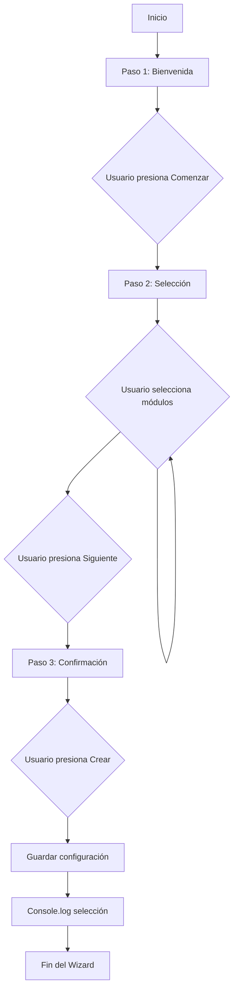
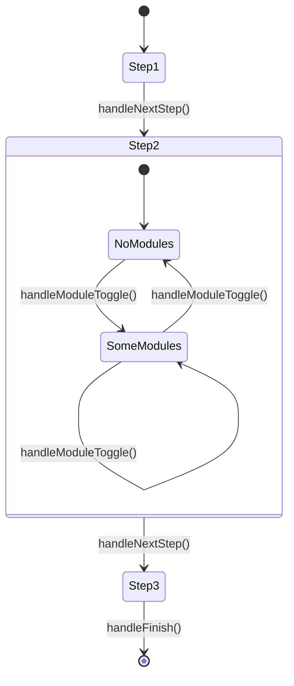
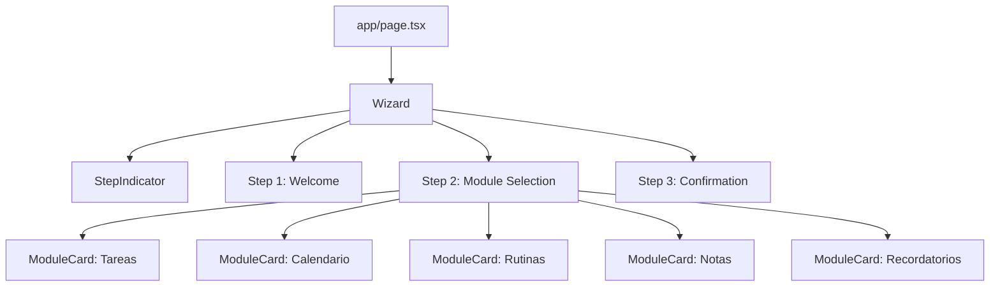

# Documento de Diseño Técnico - Planiverse

## Visión General

Planiverse es una aplicación web de organización personal modular construida con Next.js 14, TypeScript y Tailwind CSS. El sistema comienza con un wizard de configuración de 3 pasos que permite a los usuarios seleccionar qué módulos desean activar (Tareas, Calendario, Rutinas, Notas, Recordatorios). La arquitectura está diseñada para ser completamente frontend, sin dependencias de backend, utilizando React hooks para la gestión de estado local.

El diseño prioriza la simplicidad, la experiencia de usuario fluida y la escalabilidad futura para agregar nuevos módulos.

## Arquitectura

### Arquitectura de Alto Nivel

```
┌─────────────────────────────────────────┐
│         Next.js App Router              │
│                                         │
│  ┌───────────────────────────────────┐ │
│  │      app/page.tsx (Root)          │ │
│  │                                   │ │
│  │  ┌─────────────────────────────┐ │ │
│  │  │   Wizard Component          │ │ │
│  │  │                             │ │ │
│  │  │  ┌────────────────────────┐ │ │ │
│  │  │  │  StepIndicator        │ │ │ │
│  │  │  └────────────────────────┘ │ │ │
│  │  │                             │ │ │
│  │  │  ┌────────────────────────┐ │ │ │
│  │  │  │  Step 1: Welcome      │ │ │ │
│  │  │  └────────────────────────┘ │ │ │
│  │  │                             │ │ │
│  │  │  ┌────────────────────────┐ │ │ │
│  │  │  │  Step 2: Selection    │ │ │ │
│  │  │  │  ┌──────────────────┐ │ │ │ │
│  │  │  │  │  ModuleCard x5   │ │ │ │ │
│  │  │  │  └──────────────────┘ │ │ │ │
│  │  │  └────────────────────────┘ │ │ │
│  │  │                             │ │ │
│  │  │  ┌────────────────────────┐ │ │ │
│  │  │  │  Step 3: Confirmation │ │ │ │
│  │  │  └────────────────────────┘ │ │ │
│  │  └─────────────────────────────┘ │ │
│  └───────────────────────────────────┘ │
└─────────────────────────────────────────┘
```

### Principios Arquitectónicos

1. **Componentes Reutilizables**: Cada componente tiene una responsabilidad única y clara
2. **Estado Local**: Gestión de estado usando React hooks (useState) sin necesidad de librerías externas
3. **Composición**: Los componentes se componen de manera jerárquica y predecible
4. **Tipado Fuerte**: TypeScript en todos los componentes para prevenir errores en tiempo de compilación
5. **Responsive First**: Diseño mobile-first con breakpoints de Tailwind

## Componentes e Interfaces

### 1. Wizard Component

**Ubicación**: `components/Wizard.tsx`

**Responsabilidad**: Orquestar el flujo del wizard de 3 pasos, gestionar el estado global del wizard y la selección de módulos.

**Props**: Ninguna (componente raíz)

**Estado Interno**:
```typescript
interface WizardState {
  currentStep: 1 | 2 | 3;
  selectedModules: Set<ModuleType>;
}
```

**Métodos**:
- `handleNextStep()`: Avanza al siguiente paso
- `handleModuleToggle(module: ModuleType)`: Activa/desactiva un módulo
- `handleFinish()`: Finaliza el wizard y guarda la configuración

### 2. ModuleCard Component

**Ubicación**: `components/ModuleCard.tsx`

**Responsabilidad**: Renderizar una tarjeta clickeable para un módulo específico con indicación visual de su estado.

**Props**:
```typescript
interface ModuleCardProps {
  module: ModuleType;
  isSelected: boolean;
  onToggle: (module: ModuleType) => void;
}
```

**Características**:
- Estado visual diferenciado (activo/inactivo)
- Animaciones de hover y transición
- Icono y descripción del módulo
- Accesible (keyboard navigation, ARIA labels)

### 3. StepIndicator Component

**Ubicación**: `components/StepIndicator.tsx`

**Responsabilidad**: Mostrar el progreso del usuario a través de los 3 pasos del wizard.

**Props**:
```typescript
interface StepIndicatorProps {
  currentStep: 1 | 2 | 3;
  totalSteps: 3;
}
```

**Características**:
- Indicación visual del paso actual
- Pasos completados marcados visualmente
- Responsive (se adapta a diferentes tamaños de pantalla)

## Modelos de Datos

### ModuleType

```typescript
type ModuleType = 'tasks' | 'calendar' | 'routines' | 'notes' | 'reminders';
```

### Module

```typescript
interface Module {
  id: ModuleType;
  name: string;
  description: string;
  icon: string; // Emoji o nombre de icono
}
```

### Módulos Disponibles

```typescript
const AVAILABLE_MODULES: Module[] = [
  {
    id: 'tasks',
    name: 'Tareas',
    description: 'Gestiona tus tareas pendientes',
    icon: '✓'
  },
  {
    id: 'calendar',
    name: 'Calendario',
    description: 'Organiza tus eventos',
    icon: '📅'
  },
  {
    id: 'routines',
    name: 'Rutinas',
    description: 'Crea hábitos diarios',
    icon: '🔄'
  },
  {
    id: 'notes',
    name: 'Notas',
    description: 'Captura tus ideas',
    icon: '📝'
  },
  {
    id: 'reminders',
    name: 'Recordatorios',
    description: 'No olvides nada importante',
    icon: '🔔'
  }
];
```

### WizardConfig

```typescript
interface WizardConfig {
  selectedModules: ModuleType[];
  completedAt: Date;
}
```

## Propiedades de Corrección

*Una propiedad es una característica o comportamiento que debe mantenerse verdadero en todas las ejecuciones válidas del sistema - esencialmente, una declaración formal sobre lo que el sistema debe hacer. Las propiedades sirven como puente entre las especificaciones legibles por humanos y las garantías de corrección verificables por máquinas.*

### Propiedad 1: Navegación Secuencial del Wizard

*Para cualquier* estado válido del wizard en el paso N (donde N < 3), cuando el usuario presiona el botón de navegación, el sistema debe avanzar al paso N+1 y mantener toda la configuración previa.

**Valida: Requisitos 1.5, 2.14**

### Propiedad 2: Toggle de Módulos

*Para cualquier* módulo M en el conjunto de módulos disponibles, hacer click en su tarjeta debe alternar su estado: si está inactivo debe activarse, y si está activo debe desactivarse.

**Valida: Requisitos 2.8, 2.9**

### Propiedad 3: Sincronización Estado-UI

*Para cualquier* módulo M, el estado visual de su tarjeta (clases CSS, atributos ARIA) debe reflejar exactamente su estado en el conjunto selectedModules inmediatamente después de cualquier interacción.

**Valida: Requisitos 2.10, 2.12, 8.3**

### Propiedad 4: Persistencia de Estado Durante Navegación

*Para cualquier* selección de módulos S y cualquier secuencia de navegación válida entre pasos del wizard, el conjunto selectedModules debe permanecer idéntico antes y después de la navegación.

**Valida: Requisitos 8.4, 8.5**

### Propiedad 5: Indicador de Progreso Refleja Paso Actual

*Para cualquier* paso N del wizard (donde 1 ≤ N ≤ 3), el componente StepIndicator debe resaltar visualmente el paso N y marcar todos los pasos < N como completados.

**Valida: Requisitos 4.1, 4.3, 4.4, 4.5, 4.6**

### Propiedad 6: Finalización Guarda Selección

*Para cualquier* conjunto de módulos seleccionados S, cuando el usuario completa el wizard en el paso 3, el sistema debe ejecutar console.log con S y mantener S en el estado local.

**Valida: Requisitos 3.2, 3.3**

### Propiedad 7: Responsividad Mantiene Funcionalidad

*Para cualquier* tamaño de viewport V (móvil, tablet, escritorio), todas las interacciones del wizard (navegación, toggle de módulos, finalización) deben funcionar correctamente y todos los elementos interactivos deben ser accesibles.

**Valida: Requisitos 6.4, 6.5**

## Manejo de Errores

### Estrategia General

Dado que esta es una aplicación frontend sin backend, el manejo de errores se centra en:

1. **Validación de Estado**: Asegurar que el estado del wizard siempre sea válido
2. **Prevención de Errores**: Diseño defensivo que previene estados inválidos
3. **Feedback Visual**: Indicaciones claras al usuario sobre el estado de la aplicación

### Casos de Error Específicos

#### 1. Estado Inválido del Wizard

**Escenario**: El currentStep tiene un valor fuera del rango 1-3

**Manejo**:
```typescript
if (currentStep < 1 || currentStep > 3) {
  console.error('Invalid wizard step:', currentStep);
  setCurrentStep(1); // Reset to first step
}
```

#### 2. Módulo No Reconocido

**Escenario**: Se intenta toggle un módulo que no existe en AVAILABLE_MODULES

**Manejo**:
```typescript
const handleModuleToggle = (module: ModuleType) => {
  if (!AVAILABLE_MODULES.find(m => m.id === module)) {
    console.error('Unknown module:', module);
    return; // No-op
  }
  // Proceed with toggle
};
```

#### 3. Navegación Inválida

**Escenario**: Intento de navegar más allá del paso 3 o antes del paso 1

**Manejo**:
```typescript
const handleNextStep = () => {
  if (currentStep >= 3) {
    console.warn('Already at final step');
    return;
  }
  setCurrentStep((prev) => Math.min(prev + 1, 3));
};
```

### Principios de Manejo de Errores

1. **Fail Gracefully**: Nunca romper la UI, siempre proporcionar un estado válido
2. **Log for Debugging**: Usar console.error/warn para debugging en desarrollo
3. **Type Safety**: Aprovechar TypeScript para prevenir errores en tiempo de compilación
4. **Defensive Programming**: Validar inputs y estado antes de operaciones críticas

## Estrategia de Testing

### Enfoque Dual: Unit Tests + Property-Based Tests

La estrategia de testing combina pruebas unitarias tradicionales para casos específicos y edge cases, con property-based testing para verificar propiedades universales del sistema.

### Unit Testing

**Framework**: Jest + React Testing Library

**Casos de Prueba Unitarios**:

1. **Renderizado Inicial**
   - El wizard comienza en el paso 1
   - Se muestra el contenido de bienvenida correcto
   - El StepIndicator muestra paso 1 activo

2. **Contenido Específico por Paso**
   - Paso 1: Título "Bienvenido a Planiverse", botón "Comenzar"
   - Paso 2: 5 tarjetas de módulos con nombres correctos
   - Paso 3: Botón "Crear mi Planiverse"

3. **Edge Cases**
   - Intentar navegar más allá del paso 3
   - Toggle rápido del mismo módulo múltiples veces
   - Finalizar sin seleccionar ningún módulo
   - Finalizar con todos los módulos seleccionados

4. **Accesibilidad**
   - Navegación por teclado funciona
   - ARIA labels están presentes
   - Focus management es correcto

### Property-Based Testing

**Framework**: fast-check (para JavaScript/TypeScript)

**Configuración**: Mínimo 100 iteraciones por test

**Tests de Propiedades**:

#### Test 1: Navegación Secuencial
```typescript
// Feature: notes-calendar-tasks-app, Property 1: Navegación Secuencial del Wizard
// Para cualquier estado válido del wizard en el paso N (donde N < 3),
// cuando el usuario presiona el botón de navegación,
// el sistema debe avanzar al paso N+1 y mantener toda la configuración previa
```

#### Test 2: Toggle de Módulos
```typescript
// Feature: notes-calendar-tasks-app, Property 2: Toggle de Módulos
// Para cualquier módulo M en el conjunto de módulos disponibles,
// hacer click en su tarjeta debe alternar su estado
```

#### Test 3: Sincronización Estado-UI
```typescript
// Feature: notes-calendar-tasks-app, Property 3: Sincronización Estado-UI
// Para cualquier módulo M, el estado visual de su tarjeta debe reflejar
// exactamente su estado en selectedModules inmediatamente después de cualquier interacción
```

#### Test 4: Persistencia de Estado
```typescript
// Feature: notes-calendar-tasks-app, Property 4: Persistencia de Estado Durante Navegación
// Para cualquier selección de módulos S y cualquier secuencia de navegación válida,
// selectedModules debe permanecer idéntico antes y después de la navegación
```

#### Test 5: Indicador de Progreso
```typescript
// Feature: notes-calendar-tasks-app, Property 5: Indicador de Progreso Refleja Paso Actual
// Para cualquier paso N del wizard, el StepIndicator debe resaltar visualmente
// el paso N y marcar todos los pasos < N como completados
```

#### Test 6: Finalización
```typescript
// Feature: notes-calendar-tasks-app, Property 6: Finalización Guarda Selección
// Para cualquier conjunto de módulos seleccionados S,
// cuando el usuario completa el wizard, el sistema debe ejecutar console.log con S
```

#### Test 7: Responsividad
```typescript
// Feature: notes-calendar-tasks-app, Property 7: Responsividad Mantiene Funcionalidad
// Para cualquier tamaño de viewport V, todas las interacciones del wizard
// deben funcionar correctamente
```

### Generadores para Property-Based Testing

```typescript
// Generador de pasos válidos
const stepArbitrary = fc.integer({ min: 1, max: 3 });

// Generador de conjuntos de módulos
const moduleSetArbitrary = fc.array(
  fc.constantFrom('tasks', 'calendar', 'routines', 'notes', 'reminders'),
  { minLength: 0, maxLength: 5 }
).map(arr => new Set(arr));

// Generador de secuencias de navegación
const navigationSequenceArbitrary = fc.array(
  fc.constantFrom('next', 'back'),
  { minLength: 1, maxLength: 10 }
);

// Generador de viewports
const viewportArbitrary = fc.constantFrom(
  { width: 375, height: 667 },  // Mobile
  { width: 768, height: 1024 }, // Tablet
  { width: 1920, height: 1080 } // Desktop
);
```

### Cobertura de Testing

**Objetivo**: 
- 90%+ cobertura de líneas de código
- 100% de las propiedades de corrección verificadas
- Todos los edge cases documentados cubiertos

### Integración Continua

Los tests deben ejecutarse:
- En cada commit (pre-commit hook)
- En cada pull request
- Antes de cada deploy

## Consideraciones de Diseño

### Diseño Responsivo

**Breakpoints de Tailwind**:
- `sm`: 640px (móvil grande)
- `md`: 768px (tablet)
- `lg`: 1024px (desktop)
- `xl`: 1280px (desktop grande)

**Layout por Dispositivo**:

**Móvil** (< 640px):
- Wizard ocupa todo el ancho
- Tarjetas de módulos en columna única
- Botones de ancho completo
- StepIndicator compacto

**Tablet** (640px - 1024px):
- Wizard centrado con max-width
- Tarjetas en grid de 2 columnas
- Botones de ancho fijo centrados

**Desktop** (> 1024px):
- Wizard centrado con max-width más amplio
- Tarjetas en grid de 3 columnas (o 2x3 para 5 módulos)
- Layout más espacioso

### Animaciones y Transiciones

**Principios**:
- Usar clases de utilidad de Tailwind cuando sea posible
- Transiciones sutiles (200-300ms)
- Preferir `transition-all` para cambios de estado
- Animaciones de entrada/salida para cambios de paso

**Ejemplos**:
```typescript
// ModuleCard hover
className="transition-all duration-200 hover:scale-105 hover:shadow-lg"

// ModuleCard seleccionada
className="transition-colors duration-300 bg-blue-500 text-white"

// Cambio de paso
className="animate-fade-in" // Custom animation en globals.css
```

### Accesibilidad

**Requisitos WCAG 2.1 AA**:

1. **Contraste de Color**: Mínimo 4.5:1 para texto normal
2. **Navegación por Teclado**: Todos los elementos interactivos accesibles con Tab
3. **ARIA Labels**: Etiquetas descriptivas para lectores de pantalla
4. **Focus Visible**: Indicadores claros de focus
5. **Semántica HTML**: Uso correcto de elementos semánticos

**Implementación**:
```typescript
// ModuleCard
<button
  role="checkbox"
  aria-checked={isSelected}
  aria-label={`${module.name}: ${module.description}`}
  className="focus:ring-2 focus:ring-blue-500 focus:outline-none"
>
  {/* Content */}
</button>

// StepIndicator
<nav aria-label="Progreso del wizard">
  <ol>
    <li aria-current={currentStep === 1 ? 'step' : undefined}>
      Paso 1
    </li>
    {/* ... */}
  </ol>
</nav>
```

### Performance

**Optimizaciones**:

1. **Memoización**: Usar `React.memo` para ModuleCard si es necesario
2. **Lazy Loading**: No necesario para wizard (todo visible)
3. **Bundle Size**: Mantener dependencias mínimas (solo Next.js, React, Tailwind)
4. **Renderizado**: Evitar re-renders innecesarios con callbacks memoizados

```typescript
// En Wizard.tsx
const handleModuleToggle = useCallback((module: ModuleType) => {
  setSelectedModules(prev => {
    const next = new Set(prev);
    if (next.has(module)) {
      next.delete(module);
    } else {
      next.add(module);
    }
    return next;
  });
}, []);
```

### Extensibilidad Futura

**Diseño para Crecimiento**:

1. **Agregar Nuevos Módulos**: Solo requiere agregar entrada en `AVAILABLE_MODULES`
2. **Pasos Adicionales**: Arquitectura permite agregar pasos 4, 5, etc.
3. **Persistencia**: Fácil migrar de estado local a localStorage o backend
4. **Temas**: Estructura preparada para agregar dark mode

**Puntos de Extensión**:
```typescript
// Fácil agregar nuevo módulo
const NEW_MODULE: Module = {
  id: 'goals',
  name: 'Metas',
  description: 'Define y alcanza tus objetivos',
  icon: '🎯'
};

// Fácil agregar persistencia
const saveConfig = (config: WizardConfig) => {
  localStorage.setItem('planiverse-config', JSON.stringify(config));
  // O: await api.saveConfig(config);
};
```

## Decisiones de Diseño

### 1. Set vs Array para selectedModules

**Decisión**: Usar `Set<ModuleType>` en lugar de `ModuleType[]`

**Razón**: 
- Garantiza unicidad automáticamente
- Operaciones de add/delete son O(1)
- Método `has()` es más semántico que `includes()`
- Previene duplicados sin lógica adicional

### 2. Estado Local vs Context API

**Decisión**: Usar useState local en Wizard component

**Razón**:
- El estado solo se necesita en el árbol del Wizard
- No hay necesidad de compartir estado globalmente
- Más simple y directo
- Menos boilerplate

### 3. Componente Único vs Múltiples Páginas

**Decisión**: Un solo componente Wizard con renderizado condicional

**Razón**:
- Mantiene el estado naturalmente
- Transiciones más suaves
- No requiere routing adicional
- Más simple para un flujo lineal de 3 pasos

### 4. TypeScript Strict Mode

**Decisión**: Habilitar modo estricto de TypeScript

**Razón**:
- Previene errores comunes en tiempo de compilación
- Mejor autocompletado en IDEs
- Documentación implícita a través de tipos
- Facilita refactoring futuro

### 5. Tailwind vs CSS Modules

**Decisión**: Usar Tailwind CSS exclusivamente

**Razón**:
- Desarrollo más rápido
- Consistencia visual automática
- Responsive design simplificado
- Menor tamaño de bundle (purge de clases no usadas)
- Alineado con el stack del proyecto

## Diagramas

### Flujo de Usuario



### Flujo de Estado



### Jerarquía de Componentes



## Conclusión

Este diseño proporciona una base sólida para el wizard de configuración de Planiverse, con énfasis en:

- **Simplicidad**: Arquitectura directa y fácil de entender
- **Corrección**: Propiedades verificables que garantizan comportamiento correcto
- **Extensibilidad**: Diseño que facilita agregar nuevos módulos y funcionalidades
- **Experiencia de Usuario**: Interfaz responsiva, accesible y con feedback visual claro
- **Mantenibilidad**: Código tipado, testeado y bien documentado

El siguiente paso es la implementación de los componentes siguiendo este diseño, con testing continuo para verificar las propiedades de corrección definidas.
