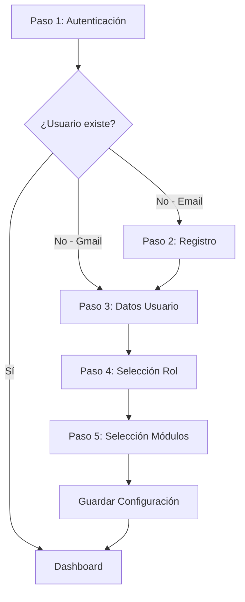

# Documento de Diseño: Sistema de Autenticación y Perfiles de Usuario

## Overview

El sistema de autenticación y perfiles de usuario expande el wizard existente de 3 pasos a 5 pasos, incorporando autenticación OAuth con Gmail y email/password, recopilación de datos personales, selección de rol con temas visuales diferenciados, y la selección de módulos existente.

La arquitectura es frontend-only, utilizando localStorage para persistencia de datos y Next.js App Router con TypeScript y Tailwind CSS. El sistema está diseñado para ser accesible, responsivo y proporcionar una experiencia de usuario fluida con validación en tiempo real.

### Objetivos del Diseño

- Expandir el wizard de 3 a 5 pasos manteniendo la arquitectura existente
- Implementar autenticación dual (OAuth Gmail y email/password) sin backend
- Gestionar perfiles de usuario con datos personales y preferencias
- Aplicar temas visuales dinámicos basados en roles
- Mantener persistencia de sesión entre visitas
- Garantizar accesibilidad WCAG AA y responsividad completa

### Alcance

Este diseño cubre:
- Componentes de autenticación (login, registro)
- Gestión de perfiles de usuario
- Sistema de temas por rol
- Persistencia en localStorage
- Validación de formularios
- Navegación del wizard expandido

No incluye:
- Backend o API server
- Autenticación real de OAuth (simulación frontend)
- Base de datos externa
- Recuperación de contraseña por email

## Architecture

### Arquitectura General

El sistema sigue una arquitectura de componentes React con gestión de estado local y persistencia en localStorage. La estructura se organiza en capas:

```
┌─────────────────────────────────────────┐
│         Presentation Layer              │
│  (React Components + Tailwind CSS)      │
├─────────────────────────────────────────┤
│         Business Logic Layer            │
│  (Hooks, Validators, State Management)  │
├─────────────────────────────────────────┤
│         Data Access Layer               │
│  (LocalStorage Manager, Auth Service)   │
├─────────────────────────────────────────┤
│         Storage Layer                   │
│         (localStorage API)              │
└─────────────────────────────────────────┘
```

### Flujo del Wizard Expandido



### Decisiones Arquitectónicas

1. **Frontend-Only OAuth**: Simulación de OAuth mediante redirección y generación de tokens ficticios, ya que no hay backend disponible.

2. **localStorage como Base de Datos**: Uso de localStorage para persistir usuarios, sesiones y perfiles. Estructura de datos JSON con namespacing para evitar colisiones.

3. **Hashing de Contraseñas**: Uso de Web Crypto API (SubtleCrypto) para hash de contraseñas en el cliente, aunque no es seguridad real sin backend.

4. **Temas Dinámicos con CSS Variables**: Implementación de temas mediante CSS custom properties que se actualizan dinámicamente según el rol seleccionado.

5. **Validación en Tiempo Real**: Validación de formularios mientras el usuario escribe, con debounce para optimizar rendimiento.

## Components and Interfaces

### Componentes Principales

#### 1. AuthStep (Paso 1)
Componente para autenticación inicial con opciones de Gmail y email/password.

```typescript
interface AuthStepProps {
  onAuthSuccess: (userId: string, isNewUser: boolean) => void;
  onError: (error: AuthError) => void;
}
```

**Responsabilidades:**
- Renderizar botones de autenticación (Gmail, Email)
- Iniciar flujo de OAuth simulado
- Mostrar formulario de login con email/password
- Validar credenciales contra localStorage
- Emitir eventos de éxito/error

#### 2. RegisterStep (Paso 2)
Componente para registro de nuevos usuarios con email/password.

```typescript
interface RegisterStepProps {
  onRegisterSuccess: (userId: string) => void;
  onBack: () => void;
  onError: (error: AuthError) => void;
}
```

**Responsabilidades:**
- Renderizar formulario de registro
- Validar formato de email
- Validar fortaleza de contraseña
- Verificar que contraseñas coincidan
- Verificar que email no esté registrado
- Crear nuevo usuario en localStorage

#### 3. UserDataStep (Paso 3)
Componente para recopilación de datos personales del usuario.

```typescript
interface UserDataStepProps {
  userId: string;
  onComplete: (userData: UserData) => void;
  onBack: () => void;
}
```

**Responsabilidades:**
- Renderizar formulario de datos personales
- Validar nombre completo (no vacío)
- Validar apodo (2-20 caracteres)
- Validar edad (5-120 años)
- Guardar datos en perfil de usuario

#### 4. RoleSelectionStep (Paso 4)
Componente para selección de rol con vista previa de temas.

```typescript
interface RoleSelectionStepProps {
  userId: string;
  onComplete: (role: UserRole) => void;
  onBack: () => void;
}
```

**Responsabilidades:**
- Renderizar opciones de rol (Estudiante, Maestro, Otro)
- Mostrar vista previa de esquema de colores
- Aplicar tema seleccionado temporalmente
- Guardar rol en perfil de usuario

#### 5. ModuleSelectionStep (Paso 5)
Componente existente adaptado con temas dinámicos.

```typescript
interface ModuleSelectionStepProps {
  userId: string;
  selectedModules: Set<ModuleType>;
  onComplete: (modules: Set<ModuleType>) => void;
  onBack: () => void;
  theme: Theme;
}
```

**Responsabilidades:**
- Renderizar tarjetas de módulos con tema aplicado
- Gestionar selección de módulos
- Finalizar configuración del wizard

#### 6. WizardContainer
Componente contenedor que orquesta el flujo completo del wizard.

```typescript
interface WizardContainerProps {
  initialStep?: WizardStep;
}

type WizardStep = 1 | 2 | 3 | 4 | 5;
```

**Responsabilidades:**
- Gestionar estado global del wizard
- Controlar navegación entre pasos
- Persistir progreso en localStorage
- Aplicar temas dinámicamente
- Manejar sesión de usuario

#### 7. StepIndicator (Actualizado)
Componente existente actualizado para 5 pasos.

```typescript
interface StepIndicatorProps {
  currentStep: WizardStep;
  totalSteps: 5;
  completedSteps: Set<WizardStep>;
}
```

### Servicios y Utilidades

#### AuthService
Servicio para gestión de autenticación.

```typescript
interface AuthService {
  // OAuth simulado
  initiateGoogleOAuth(): Promise<OAuthResult>;
  handleOAuthCallback(code: string): Promise<AuthResult>;
  
  // Email/Password
  login(email: string, password: string): Promise<AuthResult>;
  register(email: string, password: string): Promise<AuthResult>;
  
  // Sesión
  getCurrentSession(): Session | null;
  logout(): void;
  isSessionValid(session: Session): boolean;
}
```

#### LocalStorageManager
Servicio para gestión de persistencia.

```typescript
interface LocalStorageManager {
  // Usuarios
  saveUser(user: User): void;
  getUser(userId: string): User | null;
  getUserByEmail(email: string): User | null;
  
  // Sesión
  saveSession(session: Session): void;
  getSession(): Session | null;
  clearSession(): void;
  
  // Perfil
  saveProfile(userId: string, profile: UserProfile): void;
  getProfile(userId: string): UserProfile | null;
  
  // Utilidades
  isAvailable(): boolean;
  getStorageSize(): number;
  clearAll(): void;
}
```

#### ThemeManager
Servicio para gestión de temas visuales.

```typescript
interface ThemeManager {
  applyTheme(role: UserRole): void;
  getThemeForRole(role: UserRole): Theme;
  getCurrentTheme(): Theme;
}
```

#### ValidationService
Servicio para validación de formularios.

```typescript
interface ValidationService {
  validateEmail(email: string): ValidationResult;
  validatePassword(password: string): ValidationResult;
  validatePasswordMatch(password: string, confirm: string): ValidationResult;
  validateName(name: string): ValidationResult;
  validateNickname(nickname: string): ValidationResult;
  validateAge(age: number): ValidationResult;
}
```

### Hooks Personalizados

#### useAuth
Hook para gestión de autenticación.

```typescript
function useAuth(): {
  user: User | null;
  session: Session | null;
  login: (email: string, password: string) => Promise<void>;
  register: (email: string, password: string) => Promise<void>;
  loginWithGoogle: () => Promise<void>;
  logout: () => void;
  isAuthenticated: boolean;
  isLoading: boolean;
  error: AuthError | null;
}
```

#### useLocalStorage
Hook para persistencia de datos.

```typescript
function useLocalStorage<T>(
  key: string,
  initialValue: T
): [T, (value: T) => void, () => void]
```

#### useFormValidation
Hook para validación de formularios.

```typescript
function useFormValidation<T>(
  initialValues: T,
  validators: Record<keyof T, Validator>
): {
  values: T;
  errors: Record<keyof T, string>;
  touched: Record<keyof T, boolean>;
  isValid: boolean;
  handleChange: (field: keyof T, value: any) => void;
  handleBlur: (field: keyof T) => void;
  reset: () => void;
}
```

#### useTheme
Hook para gestión de temas.

```typescript
function useTheme(): {
  currentTheme: Theme;
  setTheme: (role: UserRole) => void;
  applyTheme: (theme: Theme) => void;
}
```

## Data Models

### User
Modelo de usuario con credenciales.

```typescript
interface User {
  id: string;                    // UUID generado
  email: string;                 // Email único
  passwordHash?: string;         // Hash de contraseña (opcional para OAuth)
  authMethod: 'email' | 'google'; // Método de autenticación
  createdAt: string;             // ISO timestamp
  lastLogin: string;             // ISO timestamp
}
```

### UserProfile
Modelo de perfil de usuario con datos personales y preferencias.

```typescript
interface UserProfile {
  userId: string;                // Referencia a User.id
  fullName: string;              // Nombre completo
  nickname: string;              // Apodo (2-20 caracteres)
  age: number;                   // Edad (5-120)
  role: UserRole;                // Rol seleccionado
  selectedModules: ModuleType[]; // Módulos seleccionados
  theme: Theme;                  // Tema aplicado
  createdAt: string;             // ISO timestamp
  updatedAt: string;             // ISO timestamp
}
```

### Session
Modelo de sesión activa.

```typescript
interface Session {
  userId: string;                // Referencia a User.id
  token: string;                 // Token de sesión (UUID)
  createdAt: string;             // ISO timestamp
  expiresAt: string;             // ISO timestamp (7 días)
}
```

### UserRole
Tipo de rol de usuario.

```typescript
type UserRole = 'student' | 'teacher' | 'other';
```

### Theme
Modelo de tema visual.

```typescript
interface Theme {
  role: UserRole;
  colors: {
    primary: string;             // Color primario
    primaryHover: string;        // Color primario hover
    primaryActive: string;       // Color primario active
    secondary: string;           // Color secundario
    accent: string;              // Color de acento
    background: string;          // Color de fondo
    text: string;                // Color de texto
    textSecondary: string;       // Color de texto secundario
  };
}
```

### Temas Predefinidos

```typescript
const THEMES: Record<UserRole, Theme> = {
  student: {
    role: 'student',
    colors: {
      primary: '#3B82F6',        // blue-500
      primaryHover: '#2563EB',   // blue-600
      primaryActive: '#1D4ED8',  // blue-700
      secondary: '#10B981',      // green-500
      accent: '#06B6D4',         // cyan-500
      background: '#F0F9FF',     // blue-50
      text: '#1E293B',           // slate-800
      textSecondary: '#64748B',  // slate-500
    }
  },
  teacher: {
    role: 'teacher',
    colors: {
      primary: '#F97316',        // orange-500
      primaryHover: '#EA580C',   // orange-600
      primaryActive: '#C2410C',  // orange-700
      secondary: '#EF4444',      // red-500
      accent: '#F59E0B',         // amber-500
      background: '#FFF7ED',     // orange-50
      text: '#1E293B',           // slate-800
      textSecondary: '#64748B',  // slate-500
    }
  },
  other: {
    role: 'other',
    colors: {
      primary: '#8B5CF6',        // violet-500
      primaryHover: '#7C3AED',   // violet-600
      primaryActive: '#6D28D9',  // violet-700
      secondary: '#6B7280',      // gray-500
      accent: '#A855F7',         // purple-500
      background: '#F5F3FF',     // violet-50
      text: '#1E293B',           // slate-800
      textSecondary: '#64748B',  // slate-500
    }
  }
};
```

### AuthResult
Resultado de operación de autenticación.

```typescript
interface AuthResult {
  success: boolean;
  userId?: string;
  isNewUser?: boolean;
  error?: AuthError;
}
```

### AuthError
Errores de autenticación.

```typescript
interface AuthError {
  code: AuthErrorCode;
  message: string;
}

type AuthErrorCode =
  | 'invalid_credentials'
  | 'email_already_exists'
  | 'invalid_email'
  | 'weak_password'
  | 'oauth_failed'
  | 'storage_unavailable'
  | 'storage_full'
  | 'session_expired';
```

### ValidationResult
Resultado de validación.

```typescript
interface ValidationResult {
  isValid: boolean;
  error?: string;
}
```

### UserData
Datos del usuario para el paso 3.

```typescript
interface UserData {
  fullName: string;
  nickname: string;
  age: number;
}
```

### LocalStorage Structure
Estructura de datos en localStorage.

```typescript
// Keys utilizadas
const STORAGE_KEYS = {
  USERS: 'planiverse_users',           // User[]
  PROFILES: 'planiverse_profiles',     // Record<userId, UserProfile>
  SESSION: 'planiverse_session',       // Session
  WIZARD_PROGRESS: 'planiverse_wizard_progress' // WizardProgress
};

interface WizardProgress {
  userId: string;
  currentStep: WizardStep;
  completedSteps: WizardStep[];
  tempData: {
    userData?: UserData;
    selectedRole?: UserRole;
    selectedModules?: ModuleType[];
  };
}
```


## Correctness Properties

*A property is a characteristic or behavior that should hold true across all valid executions of a system-essentially, a formal statement about what the system should do. Properties serve as the bridge between human-readable specifications and machine-verifiable correctness guarantees.*

### Property Reflection

Después de analizar los 75 criterios de aceptación, identifiqué las siguientes redundancias:

- **Navegación del wizard**: Varios criterios (2.6, 3.6, 4.6, 5.4, 7.5) describen navegación entre pasos. Estos se pueden consolidar en una propiedad general de navegación.
- **Persistencia de datos**: Múltiples criterios (1.2, 3.5, 4.5, 5.3, 7.3, 8.1) describen almacenamiento en localStorage. Se pueden consolidar en propiedades de persistencia por tipo de dato.
- **Validación de formularios**: Los criterios 10.1-10.5 describen comportamientos relacionados de validación que se pueden consolidar.
- **Indicador de progreso**: Los criterios 12.2-12.5 describen actualizaciones del indicador que se pueden consolidar.
- **Temas por rol**: Los criterios 6.1-6.3 son ejemplos específicos que no necesitan propiedades separadas, solo verificación de ejemplos.

### Propiedades de Autenticación

#### Property 1: OAuth Flow Initiation
*For any* click on the "Sign in with Gmail" button, the system should initiate the OAuth flow by redirecting to the OAuth provider or showing the OAuth modal.

**Validates: Requirements 1.1**

#### Property 2: OAuth Success Persistence
*For any* successful OAuth authentication, the user data should be stored in localStorage and retrievable by user ID.

**Validates: Requirements 1.2**

#### Property 3: Existing User Recognition
*For any* user that already exists in localStorage, authentication should load their existing profile and redirect to the dashboard without going through the wizard.

**Validates: Requirements 1.3**

#### Property 4: New User Wizard Flow
*For any* new user authenticated via OAuth, the wizard should continue to step 3 (User Data).

**Validates: Requirements 1.4**

#### Property 5: OAuth Error Handling
*For any* failed OAuth flow, the system should display a descriptive error message to the user.

**Validates: Requirements 1.5**

#### Property 6: Email Format Validation
*For any* email input, the system should validate that it matches a valid email format before processing authentication.

**Validates: Requirements 2.2**

#### Property 7: Credential Verification
*For any* login attempt with existing credentials, the system should verify the credentials against localStorage and return success only if both email and password hash match.

**Validates: Requirements 2.3**

#### Property 8: Successful Login Session Creation
*For any* successful login with correct credentials, the system should create a session token and load the user profile.

**Validates: Requirements 2.4**

#### Property 9: Failed Login Error Message
*For any* login attempt with incorrect credentials, the system should display a generic error message that does not reveal whether the email exists.

**Validates: Requirements 2.5**

### Propiedades de Registro

#### Property 10: Password Length Validation
*For any* password input during registration, the system should reject passwords with fewer than 8 characters.

**Validates: Requirements 3.2**

#### Property 11: Password Confirmation Match
*For any* password and confirmation pair, the system should validate that both values are identical before allowing registration.

**Validates: Requirements 3.3**

#### Property 12: Email Uniqueness Validation
*For any* registration attempt, the system should reject the registration if the email already exists in localStorage.

**Validates: Requirements 3.4, 3.7**

#### Property 13: Password Hashing on Registration
*For any* successful registration, the stored password should be hashed (not plaintext) in localStorage.

**Validates: Requirements 3.5**

#### Property 14: Registration Success Navigation
*For any* successful registration, the wizard should advance to step 3 (User Data).

**Validates: Requirements 3.6**

### Propiedades de Datos de Usuario

#### Property 15: Full Name Non-Empty Validation
*For any* full name input, the system should reject empty strings or strings containing only whitespace.

**Validates: Requirements 4.2**

#### Property 16: Nickname Length Validation
*For any* nickname input, the system should accept only strings with length between 2 and 20 characters (inclusive).

**Validates: Requirements 4.3**

#### Property 17: Age Range Validation
*For any* age input, the system should accept only numbers between 5 and 120 (inclusive).

**Validates: Requirements 4.4**

#### Property 18: User Data Persistence
*For any* completed user data form, the data should be stored in the user profile in localStorage and retrievable by user ID.

**Validates: Requirements 4.5**

### Propiedades de Selección de Rol y Temas

#### Property 19: Role Selection Persistence
*For any* role selection (student, teacher, other), the selected role should be stored in the user profile in localStorage.

**Validates: Requirements 5.3**

#### Property 20: Role-Theme Association
*For any* selected role, the system should associate the correct theme (student → blue/green, teacher → orange/red, other → purple/gray) with the user profile.

**Validates: Requirements 5.5, 6.4**

#### Property 21: Theme Persistence
*For any* theme applied after role selection, the theme should be stored in localStorage and persist across browser sessions.

**Validates: Requirements 6.5**

#### Property 22: Theme Loading on Login
*For any* user login, the system should automatically load and apply the theme associated with the user's saved role.

**Validates: Requirements 6.6**

### Propiedades de Selección de Módulos

#### Property 23: Module Selection Persistence
*For any* set of selected modules, the selections should be stored in the user profile in localStorage.

**Validates: Requirements 7.3**

#### Property 24: Complete Configuration Persistence
*For any* wizard completion, all user data (credentials, profile, role, theme, modules) should be saved to localStorage.

**Validates: Requirements 7.4**

### Propiedades de Sesión

#### Property 25: Session Token Creation
*For any* successful wizard completion or login, the system should create and store a session token in localStorage.

**Validates: Requirements 8.1**

#### Property 26: Session Validation on Load
*For any* application load, the system should check localStorage for an existing session and validate it.

**Validates: Requirements 8.2**

#### Property 27: Valid Session Auto-Login
*For any* valid (non-expired) session found on application load, the system should load the user profile and redirect to the dashboard.

**Validates: Requirements 8.3**

#### Property 28: Invalid Session Redirect
*For any* application load without a valid session, the system should display step 1 of the wizard.

**Validates: Requirements 8.4**

#### Property 29: Session Timestamp Inclusion
*For any* created session, the session object should include a createdAt timestamp for expiration validation.

**Validates: Requirements 8.5**

#### Property 30: Logout Session Removal
*For any* logout action, the session token should be removed from localStorage.

**Validates: Requirements 9.1**

#### Property 31: Logout Memory Cleanup
*For any* logout action, all session data in application memory should be cleared.

**Validates: Requirements 9.2**

#### Property 32: Profile Persistence After Logout
*For any* logout action, the user profile should remain in localStorage for future logins.

**Validates: Requirements 9.4**

### Propiedades de Validación de Formularios

#### Property 33: Real-Time Validation
*For any* form input change, the system should validate the input and update error messages immediately (with debounce).

**Validates: Requirements 10.1, 10.4, 10.5**

#### Property 34: Next Button Disabled on Errors
*For any* wizard step with validation errors, the "Next" button should be disabled.

**Validates: Requirements 10.2**

#### Property 35: Error Visual Indicators
*For any* form field with validation errors, the field should display visual error indicators (red border/text).

**Validates: Requirements 10.3**

### Propiedades de Navegación del Wizard

#### Property 36: Back Button Visibility
*For any* wizard step from 2 to 5, a "Back" button should be visible and functional.

**Validates: Requirements 11.1**

#### Property 37: Data Preservation on Navigation
*For any* navigation between wizard steps (forward or backward), all previously entered data should be preserved.

**Validates: Requirements 11.2, 11.3**

#### Property 38: Progress Indicator Update
*For any* step change in the wizard, the progress indicator should update to reflect the current step.

**Validates: Requirements 11.4, 12.2**

#### Property 39: Forward Navigation Validation
*For any* attempt to navigate forward in the wizard, the navigation should be prevented if the current step has validation errors.

**Validates: Requirements 11.5**

#### Property 40: Completed Steps Indicator
*For any* completed wizard step, the progress indicator should mark that step with a checkmark icon.

**Validates: Requirements 12.3**

#### Property 41: Future Steps Inactive State
*For any* wizard step that has not been reached yet, the progress indicator should display it in an inactive state.

**Validates: Requirements 12.4**

### Propiedades de Manejo de Errores de localStorage

#### Property 42: localStorage Availability Detection
*For any* application load, the system should detect whether localStorage is available and handle unavailability gracefully.

**Validates: Requirements 13.1**

#### Property 43: Storage Full Error Handling
*For any* attempt to write to localStorage when it is full, the system should catch the error and display a user-friendly message.

**Validates: Requirements 13.2**

#### Property 44: Write Validation
*For any* write operation to localStorage, the system should verify that the data was successfully written by reading it back.

**Validates: Requirements 13.5**

### Propiedades de Accesibilidad

#### Property 45: Keyboard Navigation
*For any* interactive element in the wizard, it should be reachable and operable using only keyboard navigation (Tab, Enter, Space, Arrow keys).

**Validates: Requirements 14.1**

#### Property 46: ARIA Attributes Presence
*For any* interactive element in the wizard, it should include appropriate ARIA attributes (role, aria-label, aria-describedby, etc.).

**Validates: Requirements 14.2**

#### Property 47: Step Change Announcements
*For any* wizard step change, the new step should be announced to screen readers via aria-live regions.

**Validates: Requirements 14.3**

#### Property 48: Focus Visibility
*For any* focused element in the wizard, the focus indicator should be clearly visible with sufficient contrast.

**Validates: Requirements 14.4**

#### Property 49: Color Contrast Compliance
*For any* theme (student, teacher, other), all text and interactive elements should meet WCAG AA contrast ratio requirements (4.5:1 for normal text, 3:1 for large text).

**Validates: Requirements 14.5**

#### Property 50: Validation Error Announcements
*For any* validation error that appears, the error message should be announced to screen readers.

**Validates: Requirements 14.6**

### Propiedades de Responsividad

#### Property 51: Responsive Layout Adaptation
*For any* screen width from 320px to 2560px, the wizard should adapt its layout without horizontal scrolling.

**Validates: Requirements 15.2, 15.4**

#### Property 52: Touch Target Sizing
*For any* interactive element on mobile viewports (<768px), the touch target should be at least 44x44 pixels.

**Validates: Requirements 15.3**

#### Property 53: Functional Completeness Across Viewports
*For any* screen size, all wizard functionality (authentication, registration, data entry, role selection, module selection) should be fully accessible and operational.

**Validates: Requirements 15.5**

## Error Handling

### Error Categories

#### 1. Authentication Errors

**OAuth Errors:**
- OAuth provider unavailable
- OAuth flow cancelled by user
- OAuth token exchange failure
- Invalid OAuth response

**Handling Strategy:**
- Display user-friendly error message
- Provide retry option
- Log error details for debugging
- Fallback to email/password option

**Email/Password Errors:**
- Invalid email format
- Email not found
- Incorrect password
- Account already exists
- Weak password

**Handling Strategy:**
- Display specific validation errors inline
- Generic error for login failures (security)
- Prevent form submission until errors resolved
- Clear error messages on input change

#### 2. Storage Errors

**localStorage Errors:**
- localStorage not available (private browsing)
- localStorage quota exceeded
- Write operation failed
- Read operation failed
- Data corruption

**Handling Strategy:**
- Detect availability on app load
- Show warning if unavailable
- Catch quota exceeded errors
- Provide user guidance (clear old data)
- Validate writes by reading back
- Graceful degradation (in-memory fallback)

#### 3. Validation Errors

**Form Validation Errors:**
- Empty required fields
- Invalid format (email, age)
- Out of range values
- Mismatched passwords
- Duplicate email

**Handling Strategy:**
- Real-time validation with debounce
- Display errors inline near field
- Disable submit button when errors exist
- Clear errors when user corrects input
- Accessible error announcements

#### 4. Session Errors

**Session Management Errors:**
- Session expired
- Session not found
- Invalid session token
- Session data corrupted

**Handling Strategy:**
- Check session validity on app load
- Redirect to login if invalid
- Clear corrupted session data
- Create new session on login
- Set reasonable expiration (7 days)

#### 5. Navigation Errors

**Wizard Navigation Errors:**
- Attempt to skip steps
- Navigate forward with incomplete data
- Invalid step number
- Lost wizard state

**Handling Strategy:**
- Validate step completion before navigation
- Preserve data in localStorage during navigation
- Reset to step 1 if state is corrupted
- Prevent direct URL manipulation

### Error Recovery Strategies

#### Automatic Recovery
- Retry failed localStorage operations (max 3 attempts)
- Regenerate corrupted session tokens
- Reset to safe state (step 1) on critical errors

#### User-Initiated Recovery
- "Try Again" buttons for failed operations
- "Clear Data" option for storage issues
- "Start Over" option to reset wizard

#### Graceful Degradation
- In-memory storage if localStorage unavailable
- Simplified UI if theme loading fails
- Basic validation if advanced validation fails

### Error Logging

For development and debugging:
- Console.error for all caught errors
- Include error context (user action, step, data)
- Sanitize sensitive data (passwords) from logs
- Track error frequency for monitoring

## Testing Strategy

### Dual Testing Approach

This feature requires both unit testing and property-based testing for comprehensive coverage:

- **Unit Tests**: Verify specific examples, edge cases, error conditions, and integration points
- **Property Tests**: Verify universal properties across all inputs through randomization

Both approaches are complementary and necessary. Unit tests catch concrete bugs in specific scenarios, while property tests verify general correctness across a wide range of inputs.

### Property-Based Testing

**Library Selection:**
- **JavaScript/TypeScript**: Use `fast-check` library for property-based testing
- Minimum 100 iterations per property test (due to randomization)
- Each test must reference its design document property

**Property Test Configuration:**

```typescript
import fc from 'fast-check';

// Example property test structure
describe('Property Tests - User Authentication', () => {
  it('Property 6: Email Format Validation', () => {
    // Feature: user-authentication-profiles, Property 6: Email Format Validation
    fc.assert(
      fc.property(fc.emailAddress(), (email) => {
        const result = validateEmail(email);
        expect(result.isValid).toBe(true);
      }),
      { numRuns: 100 }
    );
  });
});
```

**Tag Format for Property Tests:**
```typescript
// Feature: user-authentication-profiles, Property {number}: {property_text}
```

### Unit Testing Strategy

**Test Organization:**
- Group tests by component/service
- Use descriptive test names
- Follow AAA pattern (Arrange, Act, Assert)
- Mock external dependencies (localStorage, OAuth)

**Coverage Areas:**

1. **Component Tests** (React Testing Library):
   - Render tests for each wizard step
   - User interaction tests (clicks, typing)
   - Conditional rendering based on state
   - Accessibility attributes presence
   - Theme application

2. **Service Tests** (Jest):
   - AuthService methods
   - LocalStorageManager operations
   - ThemeManager theme application
   - ValidationService rules

3. **Hook Tests** (React Hooks Testing Library):
   - useAuth state management
   - useFormValidation behavior
   - useTheme theme switching
   - useLocalStorage persistence

4. **Integration Tests**:
   - Complete wizard flow
   - Authentication to dashboard flow
   - Session persistence across reloads
   - Theme persistence and loading

### Property-Based Test Cases

Based on the 53 correctness properties, implement property tests for:

**Authentication Properties (1-9):**
- Property 2: OAuth data persistence round-trip
- Property 6: Email format validation with generated emails
- Property 7: Credential verification with random credentials
- Property 9: Failed login error consistency

**Registration Properties (10-14):**
- Property 10: Password length validation with random lengths
- Property 11: Password confirmation matching
- Property 12: Email uniqueness with random emails
- Property 13: Password hashing verification

**Validation Properties (15-18):**
- Property 15: Full name validation with random strings
- Property 16: Nickname length validation with random strings
- Property 17: Age range validation with random numbers
- Property 18: User data persistence round-trip

**Role and Theme Properties (19-22):**
- Property 19: Role selection persistence round-trip
- Property 20: Role-theme association correctness
- Property 21: Theme persistence round-trip
- Property 22: Theme loading on login

**Session Properties (25-32):**
- Property 25: Session token creation and format
- Property 27: Valid session auto-login behavior
- Property 29: Session timestamp presence
- Property 30: Logout session removal verification

**Form Validation Properties (33-35):**
- Property 33: Real-time validation with random inputs
- Property 34: Button state based on validation errors
- Property 35: Error indicators presence

**Navigation Properties (36-41):**
- Property 37: Data preservation during navigation
- Property 38: Progress indicator accuracy
- Property 39: Forward navigation validation

**Accessibility Properties (45-50):**
- Property 46: ARIA attributes presence on all interactive elements
- Property 49: Color contrast ratios for all themes
- Property 52: Touch target sizing on mobile

**Responsivity Properties (51-53):**
- Property 51: Layout adaptation across viewport sizes
- Property 53: Functional completeness across viewports

### Unit Test Cases

**Specific Examples and Edge Cases:**

1. **Authentication Examples:**
   - Login with valid credentials
   - Login with invalid credentials
   - OAuth success flow
   - OAuth cancellation
   - OAuth error

2. **Registration Examples:**
   - Register with valid data
   - Register with existing email
   - Register with weak password
   - Register with mismatched passwords

3. **User Data Examples:**
   - Submit with valid data
   - Submit with empty name
   - Submit with nickname too short/long
   - Submit with age out of range

4. **Role Selection Examples:**
   - Select student role → verify blue/green theme
   - Select teacher role → verify orange/red theme
   - Select other role → verify purple/gray theme

5. **Module Selection Examples:**
   - Select no modules
   - Select all modules
   - Select and deselect modules

6. **Session Examples:**
   - Valid session → auto-login
   - Expired session → show login
   - No session → show login
   - Logout → clear session

7. **Error Handling Examples:**
   - localStorage unavailable
   - localStorage full
   - Corrupted session data
   - Invalid wizard state

8. **Navigation Examples:**
   - Navigate forward through all steps
   - Navigate backward preserving data
   - Attempt to skip steps (should fail)
   - Complete wizard and redirect

9. **Accessibility Examples:**
   - Tab through all interactive elements
   - Submit form with Enter key
   - Screen reader announcements
   - Focus indicators visible

10. **Responsive Examples:**
    - Render at 320px width
    - Render at 768px width
    - Render at 1920px width
    - Touch targets on mobile

### Test Data Generators

For property-based testing, create generators for:

```typescript
// User data generators
const userGenerator = fc.record({
  email: fc.emailAddress(),
  password: fc.string({ minLength: 8, maxLength: 50 }),
  fullName: fc.string({ minLength: 1, maxLength: 100 }),
  nickname: fc.string({ minLength: 2, maxLength: 20 }),
  age: fc.integer({ min: 5, max: 120 }),
  role: fc.constantFrom('student', 'teacher', 'other'),
});

// Invalid data generators for error testing
const invalidEmailGenerator = fc.string().filter(s => !isValidEmail(s));
const weakPasswordGenerator = fc.string({ maxLength: 7 });
const invalidAgeGenerator = fc.integer().filter(n => n < 5 || n > 120);
```

### Mocking Strategy

**localStorage Mock:**
```typescript
const localStorageMock = {
  store: {} as Record<string, string>,
  getItem: jest.fn((key) => localStorageMock.store[key] || null),
  setItem: jest.fn((key, value) => { localStorageMock.store[key] = value; }),
  removeItem: jest.fn((key) => { delete localStorageMock.store[key]; }),
  clear: jest.fn(() => { localStorageMock.store = {}; }),
};
```

**OAuth Mock:**
```typescript
const mockOAuthFlow = jest.fn(() => 
  Promise.resolve({
    success: true,
    userId: 'mock-user-id',
    email: 'test@example.com',
  })
);
```

### Test Execution

**Commands:**
```bash
# Run all tests
npm test

# Run unit tests only
npm test -- --testPathPattern=unit

# Run property tests only
npm test -- --testPathPattern=property

# Run with coverage
npm test -- --coverage

# Run in watch mode
npm test -- --watch
```

**Coverage Goals:**
- Line coverage: >80%
- Branch coverage: >75%
- Function coverage: >85%
- Property tests: 100 iterations minimum

### Continuous Integration

- Run all tests on every commit
- Fail build if tests fail
- Generate coverage reports
- Track coverage trends over time
- Run accessibility tests (axe-core)
- Run visual regression tests (if applicable)

